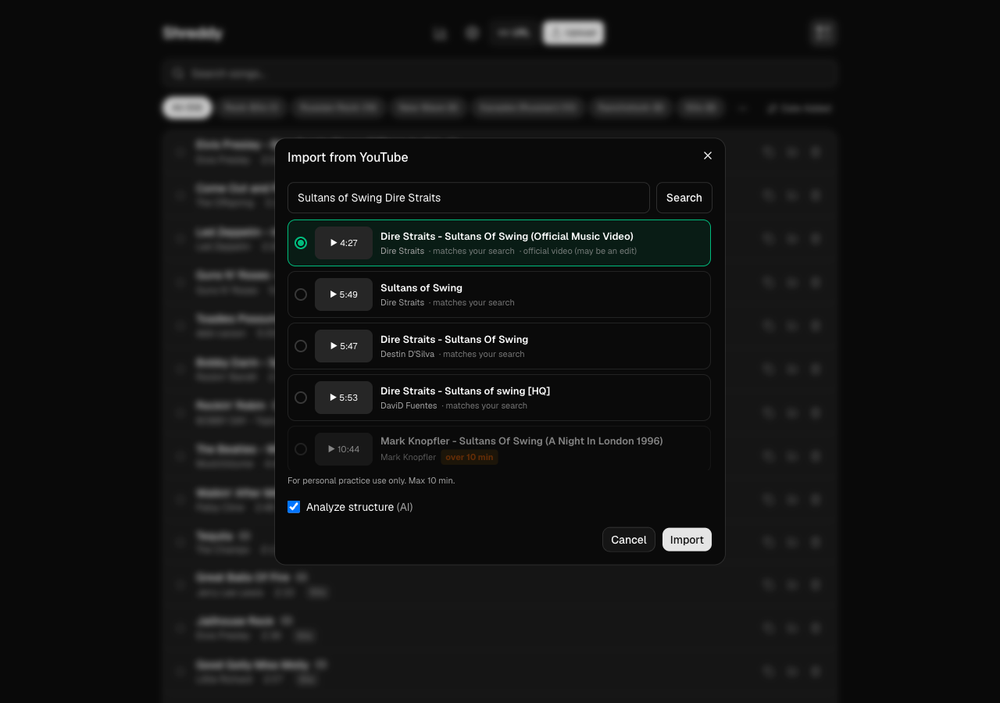
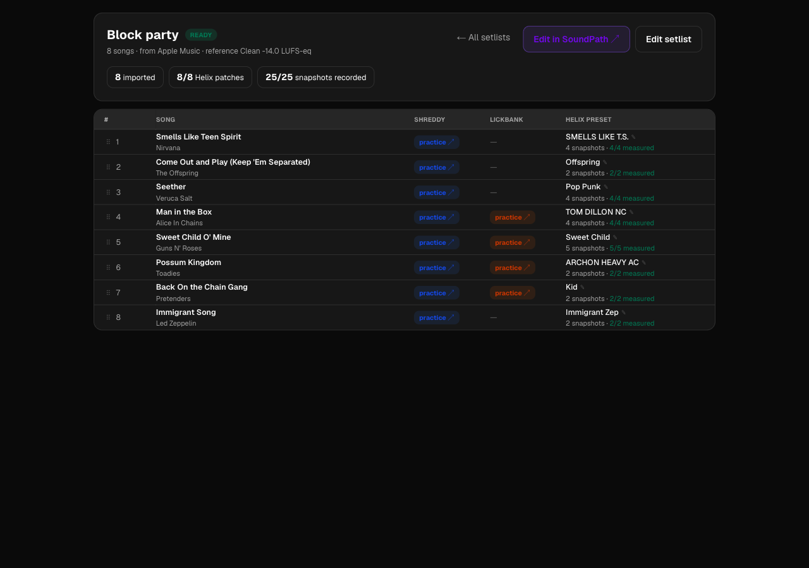

# music-apps

> Six web apps for guitarists who like to practice slowly, listen carefully, and own their tools.

I'm a guitar player. I built these because the off-the-shelf options either kept changing their pricing model, lost my data when the company pivoted, or just weren't quite right for how I actually practice. Everything here is **local-first, iPad-ready, free, and yours to fork.**

Together they cover a real practice loop: **find something to learn → slow it down → train your ears → stay in time → dial in your sound → take it to a gig.**

```
        Find a song            Pull a lick out
        or a YouTube clip      of any video
                │                    │
                ▼                    ▼
            Shreddy              LickBank ───┐
        practice the song    drill the riff  │
                │                    │       │
                ▼                    ▼       ▼
            Metronome ◄──── ChordCraft ────  SoundPath
        stay in time         train your ear   shape your tone
                                                   │
                                                   ▼
                                              Setlists
                                          build the gig, then
                                          level it end to end
```

Six apps, one monorepo, one URL behind a local proxy. Use the ones you want.

---

## The apps

### Shreddy — practice the song you can't quite play yet

Drop in any MP3, or search YouTube without leaving the app. Shreddy auto-detects sections (Intro, Verse, Chorus, Solo, etc.), BPM, and key. Then you slow it down without changing pitch and loop the hard four bars until your fingers know it.


**Supported features**

*Library*
- Upload MP3 / MP4, or search YouTube from the import dialog — or paste a URL, as before
- Auto-detected metadata: BPM, musical key, artist, album, genre, year
- Auto-detected song structure (Intro / Verse / Chorus / Bridge / Solo / Outro) via local SongFormer model — no cloud round-trip, ~30s per song
- Folders to group songs, pin favourites, search and sort by title / artist / date

Search results are ranked and annotated with *why* they scored, so you can tell the
album cut from a ten-minute live version before importing. Anything over your
duration limit is greyed out with the limit named, rather than hidden or left to
fail at import:



*Practice player*


- Section timeline color-coded by detected sections — tap to loop, shift-tap to chain multiple sections
- Tempo control 0.1× → 1.2× without affecting pitch (ultra-slow 0.1×–0.4× via a server-side ffmpeg stretch, since iPad Safari clamps `playbackRate` at 0.5×)
- Pitch shifter ±12 semitones without affecting tempo (server-side ffmpeg, cached per song/pitch)
- Stem separation (Demucs) with a per-stem mixer — isolate or mute vocals / drums / bass / other
- A-B loop with custom markers anywhere in the song
- Deep-practice modes: Silent/mental-rehearsal toggle, rotating cue prompts, and a dual-task Distraction overlay
- Bar count per section, time signature display (4/4, 3/4, 6/8), section CSV export
- Share a clip of any section as a downloadable audio file
- Practice notes per song
- **Find tone** — jumps straight into Tone Search with the song's title and artist, so a tone hunt starts from what you're playing rather than a blank box
- Built-in metronome synced to detected BPM
- Remembers position, tempo, pitch, selected section across reloads
- Optimized for iPad Safari — full-network mode (`--hostname 0.0.0.0`) for couch practice

Stem mixer — isolate or mute vocals / drums / bass / other:


Deep practice — a dual-task Distraction overlay layers a read-aloud prompt over the passage:


*Practice stats*


- Today / week / streak / all-time practice time
- 7-day bar chart
- Top 5 most-practiced songs this week
- Per-section logs (loop counts + time spent)

[→ Shreddy README](apps/shreddy/README.md)

---

### LickBank — your personal lick library, sourced from YouTube

You hear a great phrase in a YouTube cover or lesson and you know you'll forget it by tomorrow. LickBank fixes that. Paste a YouTube URL, set in/out points, save the clip with notes, organize by source and folder.


**Supported features**

*Library*
- Import any YouTube video as a source — automatic title, duration, channel. Search from the import dialog with the same ranked picker Shreddy uses, or paste a URL
- Two views: all individual licks (grid of clip thumbnails) or grouped by source video
- Custom folders + drag-to-organize
- Search across lick names, source titles, channels
- Per-folder lick counts

*Source detail + clipping*


- Side-by-side YouTube embed + waveform timeline
- Set start / end via `Set to playhead` or arrow nudges (±1s)
- Drag existing lick handles directly on the waveform to refine boundaries
- Lick metadata: name, notes, position relative to source
- Save and replay any clipped lick — instantly jumps to its position in the source
- iPad-friendly: source + waveform render side-by-side, sticky left column survives scroll

[→ LickBank README](apps/lickbank/README.md)

---

### ChordCraft — train your ear on real progressions

Pick a key. Pick a difficulty. Hit play. Name what you hear before the reveal. Sounds like a song, not piano flashcards — drums and bass are mixed in, the chords are voiced for guitar.


**Supported features**

*Practice mode*
- 20+ built-in progressions across Blues, Country, Folk, Jazz, Pop, Rock
- Genre filters + difficulty tags (beginner / intermediate)
- Pick any of the 12 keys
- Three chord vocabularies: Basic triads, 7ths, Extended
- BPM control 40 → 240
- Independent volume sliders for Chords, Bass, Drums
- Bass and Drums toggle on/off independently
- Guitar chord diagrams for every chord in the active progression
- Shuffle to randomize within your selected filters

*Ear training*


- Two modes: Progression Recognition + Interval Training
- Easy / Medium / Hard difficulty (2-3 chord → full diatonic → extended)
- Listen-and-identify with multiple-choice answers
- Score tracker

[→ ChordCraft README](apps/chordcraft/README.md)

---

### Metronome — the clean one that doesn't drift on iPad

Web-Audio scheduled (not `setInterval`), so it stays in time even on iPad Safari, which is famously terrible at audio timing.


**Supported features**

- Big BPM readout, slider from 40 → 320 BPM
- Tap-tempo button
- Time signatures: 4/4, 3/4, 6/8
- Visual beat indicator dots, synced to playback
- Focus timer: Off / 1m / 2m / 5m / 10m / custom min:sec
- Volume control
- Dark / light mode toggle
- Web Audio scheduling — accurate even when the tab loses focus

[→ Metronome README](apps/metronome/README.md)

---

### SoundPath — level Helix presets from real recordings

For anyone running a Line 6 Helix LT. Two patches that look identical on paper can sit 30 dB apart in the room, because a modeller's loudness depends on the whole non-linear chain and its spectrum — you cannot read it off the preset. So SoundPath doesn't try. You play each snapshot once, it measures integrated loudness (ITU-R BS.1770) in the browser, and writes the correction to the path output block.


**Supported features**

- **Level a whole gig.** Record every snapshot in a setlist and ship one `.hls` where every song sits at the same target.
- **Level one preset on its own.** Same maths, one patch — for something from HelAIx or a generation, or a song that changed after the gig was recorded. Its readings can be handed back to the setlist.
- **Every reading carries the level it was taken through**, so re-recording one changed song is safe and the other twenty stay correct.
- **Confirmed versions.** A pass is frozen with its gains and stays rebuildable, so the file you took to a gig doesn't quietly change meaning next time you record.
- **Role offsets** — clean / rhythm / chorus / solo sit at chosen distances from one target, and a snapshot the output block can't reach is flagged rather than silently clamped.
- **Rename presets and snapshots, and the names go into the file.** A patch off CustomTone is called `ARCHON HEAVY AC` and its snapshots are called `WHERE?` — and those names are what you read off the pedal mid-song. Renaming edits the document, never the preset payload, whose bytes every reading is keyed to; the export stamps the typed names in. A name you typed is marked as typed, so it survives Setlists re-pushing the gig, while names read out of the payload stay derived and a fix at the source still wins.
- **The "original" download is honest about its offset.** It gives the preset exactly as stored, unless you've ticked *in the loaded file* to say the record offset is already baked into what's on the pedal — in which case the download matches what the plan believes, and the file and the corrections can't disagree.
- Live capture off the Helix's USB tap, or a `.wav` per preset. Clipped takes are refused: a clipped chord measures quieter than it is, so the plan would push it further into the ceiling.
- **Takes are archived** to `takes/` with the proposed measurement window, the window you dragged it to, and the reading each gave. Nothing reads them back — they exist so the auto-window can be tuned against real recordings instead of remembered ones.

[→ SoundPath README](apps/soundpath/README.md)

---

### Setlists — build a gig, then hand it to SoundPath

Assemble a setlist from Apple Music or a pasted list, match each song to a Helix patch and a practice video, and push the lot to SoundPath for levelling. Snapshot counts come back from SoundPath rather than being counted here, so the number next to a song is the number you actually have to record.



**Supported features**

- Import a gig from an Apple Music playlist or plain text; reorder by dragging (pointer events, so it works on the iPad)
- Match each song to a Helix preset from ToneCloud, a pasted link, or an upload
- Rename the patch a song uses, in place — `ARCHON HEAVY AC` says nothing about the song, and this label is what names the preset when you level it on its own in SoundPath
- Per-song links into Shreddy and LickBank for practice
- **Edit in SoundPath** hands the whole gig over; a single changed song can be opened there on its own

[→ Setlists README](apps/setlists/README.md)

---

## How they complement each other

You're not meant to use all six at once. The point is they share enough scaffolding that a session flows naturally:

- **Learning a new song?** Shreddy slows it down, ChordCraft trains the ear for the progression, Metronome holds the click.
- **Stuck on a riff?** LickBank clips it from the original, Shreddy lets you slow-loop it inside its parent song.
- **Tone not right?** SoundPath dials it in for Helix users; Shreddy stays your practice surface.
- **Playing out?** Setlists builds the gig and hands it to SoundPath, which levels every song against one target so nothing jumps between songs.

Same look-and-feel across all of them. One proxy so a single URL on your LAN reaches every app from any device. Shared utilities (YouTube import, ffmpeg pitch, practice stats) so behavior is consistent.

---

## Running it

Install once at the root:

```bash
npm install
```

### Recommended — the whole thing behind one URL

```bash
~/claude/run-all.sh hub    # all 6 apps + the reverse proxy → http://localhost:8080
~/claude/run-all.sh stop   # stop everything
```

Then open **http://localhost:8080/** — the launcher landing, with every app at
`/<slug>` (`/shreddy`, `/lickbank`, …). **Use this origin for normal use:** the in-app
menu (the "All apps" launcher and app-to-app switching) links to bare paths like
`/lickbank`, so it only resolves on the single proxy origin (8080). See
[`proxy/README.md`](proxy/README.md).

### Recording from another device on the LAN

SoundPath records through the browser, and `getUserMedia` only runs in a secure
context — so `http://<lan-ip>:8080` can't reach the mic at all, no matter the
permissions. The proxy also serves **https on 8443** when it finds a cert:

```bash
mkcert -cert-file lan.pem -key-file lan-key.pem <lan-ip> localhost 127.0.0.1
mv lan.pem lan-key.pem ~/.config/music-apps/certs/
```

Then record from `https://<lan-ip>:8443/soundpath`. Each device has to trust
the mkcert CA once. No cert, no TLS — the proxy says so at startup and plain
http on 8080 carries on as normal.

### Single-app dev (backend only)

```bash
npm run dev:shreddy        # http://localhost:3000/shreddy   (backend only)
npm run dev:lickbank       # http://localhost:3001/lickbank
npm run dev:chordcraft     # http://localhost:3002/chordcraft
npm run dev:metronome      # http://localhost:3003/metronome
npm run dev:soundpath      # http://localhost:3004/soundpath
npm run dev:setlists       # http://localhost:3006/setlists
```

These run one app on its own port for isolated work. Each is mounted at `/<slug>` via
`basePath`, so **cross-app links and the "All apps" launcher 404 on these direct ports** —
they only work through the proxy on 8080. (`run-all.sh` also starts HelAIx on `:3005` →
`/helaix`, which the `dev:*` scripts don't cover.)

The proxy additionally mounts two sibling projects that live outside this repo, so
cross-app links resolve: **HelAIx** at `/helaix` (describe a tone, get a `.hlx`) and
**Tone Search** at `/tones` (semantic search over indexed CustomTone Helix presets —
what Shreddy's *Find tone* button opens).

If you want them reachable off your LAN — e.g. an iPad over cellular — point
[ngrok](https://ngrok.com) at the proxy: `ngrok http 8080`.

---

## Packages

| Package | Purpose |
|---|---|
| `packages/shared`         | YouTube import + ranked search picker, ffmpeg pitch, practice stats, rename-in-place field, basepath shim — shared by Shreddy, LickBank, Setlists + SoundPath |
| `packages/ui`             | Small set of shared components |
| `packages/gain-estimator` | Helix preset loudness math, alignment, apply pipeline — used by SoundPath. Block catalog vendored from [HelAIx](https://github.com/MrCitron/helaix) (MIT). |
| `packages/helix-builder`  | Optional Python build tooling for regenerating preset skeletons. **Not required at runtime.** Depends on phelix (GPL v3) which is not bundled — see [its README](packages/helix-builder/README.md). |

## Stack

- Next.js 16, React 19, TypeScript, Tailwind CSS v4
- SQLite via Prisma (Shreddy + LickBank)
- Python (librosa + SongFormer) for Shreddy's section detection — local, free, ~30 s/song
- ffmpeg for audio normalization, pitch shifting, slicing
- yt-dlp for YouTube ingestion
- Claude / Gemini / Ollama for the optional LLM flows in Shreddy

## License

[MIT](LICENSE). Take what you want.

## Why this repo exists

I'm a guitar player who builds web apps. I started writing one for my own practice (Shreddy), then needed a place to clip licks (LickBank), then ear training (ChordCraft), then a metronome that didn't drift on iPad, then a way to wrangle my Helix LT presets (SoundPath), then somewhere to assemble a gig out of all of it (Setlists). Now they share enough scaffolding that they belong in one repo.

If any of this is useful to you, take it. Issues + PRs welcome but I run this on personal time, so responsiveness varies. Known gaps and forward-looking items live in [OPEN.md](OPEN.md).
