# music-apps

> Five web apps for guitarists who like to practice slowly, listen carefully, and own their tools.

I'm a guitar player. I built these because the off-the-shelf options either kept changing their pricing model, lost my data when the company pivoted, or just weren't quite right for how I actually practice. Everything here is **local-first, iPad-ready, free, and yours to fork.**

Together they cover a real practice loop: **find something to learn → slow it down → train your ears → stay in time → dial in your sound.**

```
        Find a song            Pull a lick out
        or a YouTube clip      of any video
                │                    │
                ▼                    ▼
            Shreddy              LickBank ───┐
        practice the song    drill the riff  │
                │                    │       │
                ▼                    ▼       ▼
            Metronome ◄──── ChordCraft ────  SoundPath
        stay in time         train your ear   shape your tone
```

Five apps, one monorepo, one URL behind a local proxy. Use the ones you want.

---

## The apps

### Shreddy — practice the song you can't quite play yet

Drop in any MP3 or paste a YouTube URL. Shreddy auto-detects sections (Intro, Verse, Chorus, Solo, etc.), BPM, and key. Then you slow it down without changing pitch and loop the hard four bars until your fingers know it.

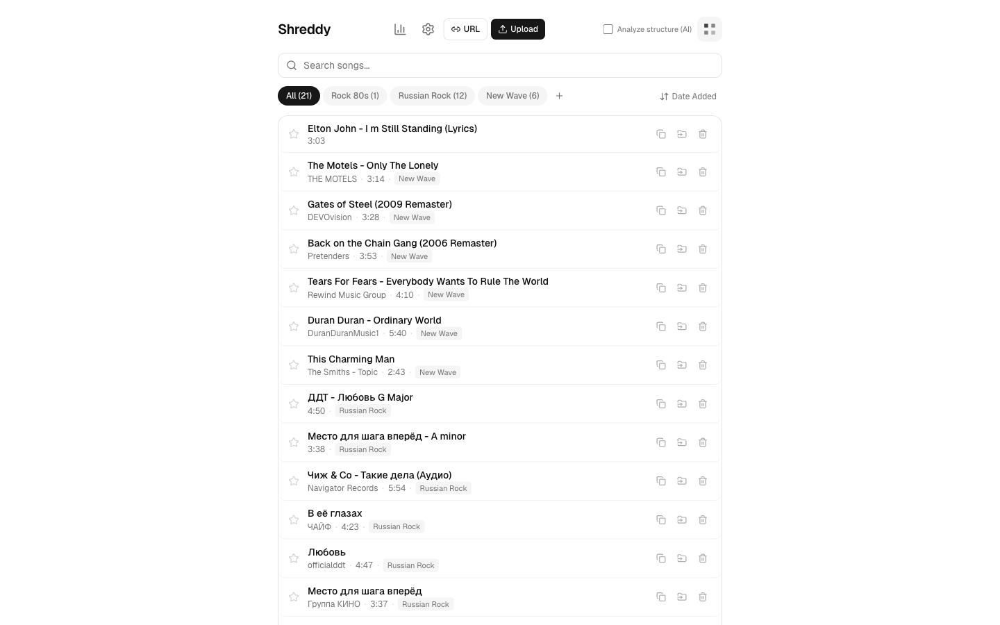

**Supported features**

*Library*
- Upload MP3 / MP4 or import direct from any YouTube URL (yt-dlp under the hood)
- Auto-detected metadata: BPM, musical key, artist, album, genre, year
- Auto-detected song structure (Intro / Verse / Chorus / Bridge / Solo / Outro) via local SongFormer model — no cloud round-trip, ~30s per song
- Folders to group songs, pin favourites, search and sort by title / artist / date

*Practice player*

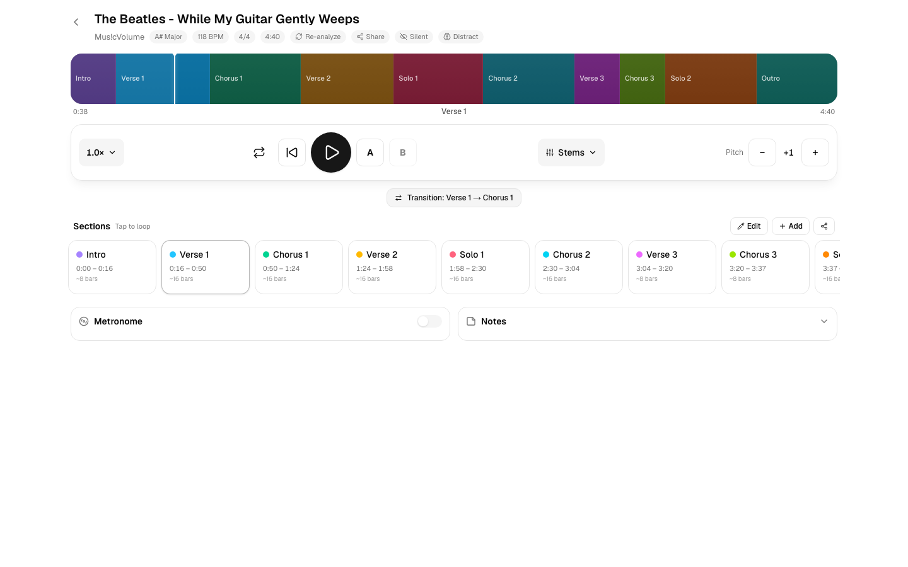

- Section timeline color-coded by detected sections — tap to loop, shift-tap to chain multiple sections
- Tempo control 0.1× → 1.2× without affecting pitch (ultra-slow 0.1×–0.4× via a server-side ffmpeg stretch, since iPad Safari clamps `playbackRate` at 0.5×)
- Pitch shifter ±12 semitones without affecting tempo (server-side ffmpeg, cached per song/pitch)
- Stem separation (Demucs) with a per-stem mixer — isolate or mute vocals / drums / bass / other
- A-B loop with custom markers anywhere in the song
- Deep-practice modes: Silent/mental-rehearsal toggle, rotating cue prompts, and a dual-task Distraction overlay
- Bar count per section, time signature display (4/4, 3/4, 6/8), section CSV export
- Share a clip of any section as a downloadable audio file
- Practice notes per song
- Built-in metronome synced to detected BPM
- Remembers position, tempo, pitch, selected section across reloads
- Optimized for iPad Safari — full-network mode (`--hostname 0.0.0.0`) for couch practice

Stem mixer — isolate or mute vocals / drums / bass / other:

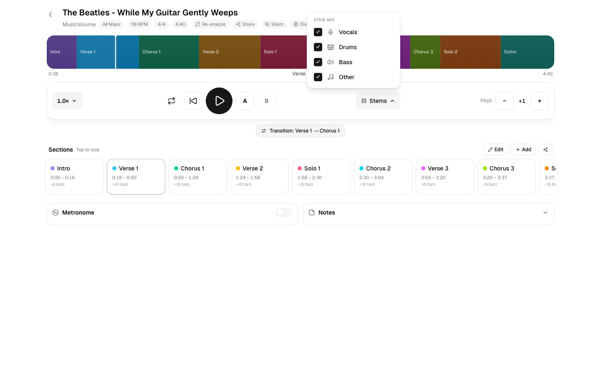

Deep practice — a dual-task Distraction overlay layers a read-aloud prompt over the passage:

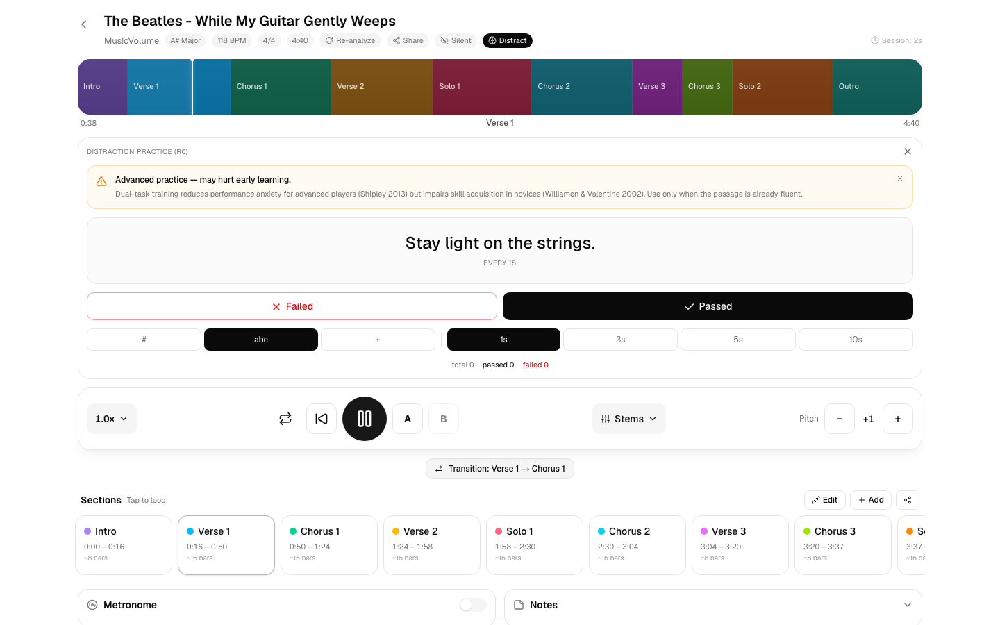

*Practice stats*

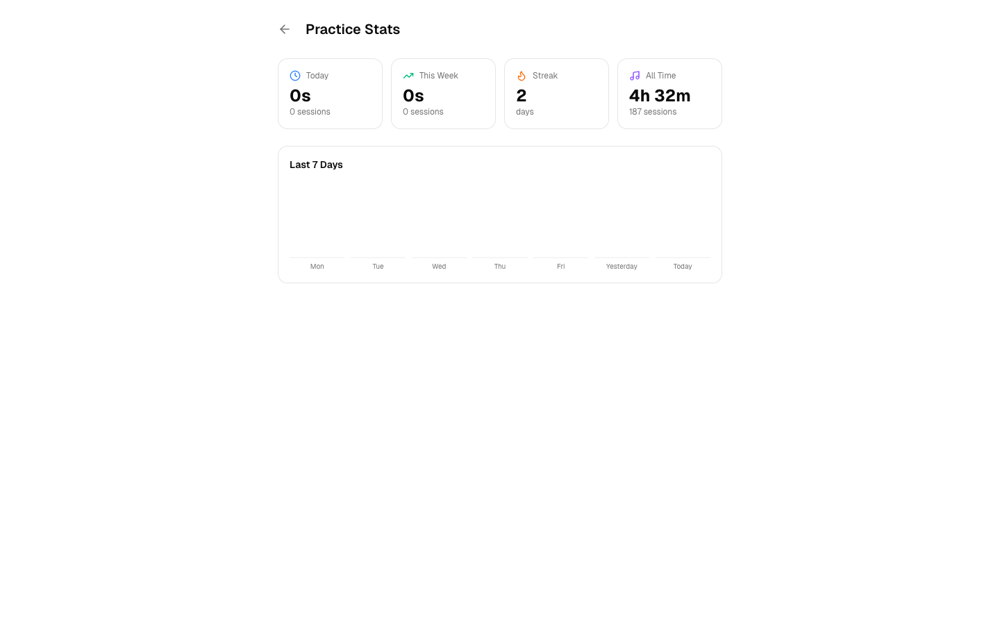

- Today / week / streak / all-time practice time
- 7-day bar chart
- Top 5 most-practiced songs this week
- Per-section logs (loop counts + time spent)

[→ Shreddy README](apps/shreddy/README.md)

---

### LickBank — your personal lick library, sourced from YouTube

You hear a great phrase in a YouTube cover or lesson and you know you'll forget it by tomorrow. LickBank fixes that. Paste a YouTube URL, set in/out points, save the clip with notes, organize by source and folder.

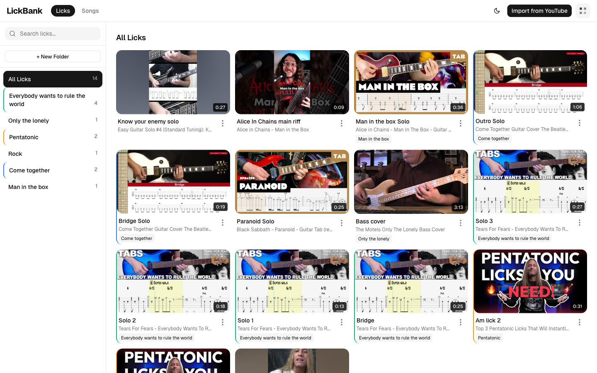

**Supported features**

*Library*
- Import any YouTube video as a source — automatic title, duration, channel
- Two views: all individual licks (grid of clip thumbnails) or grouped by source video
- Custom folders + drag-to-organize
- Search across lick names, source titles, channels
- Per-folder lick counts

*Source detail + clipping*

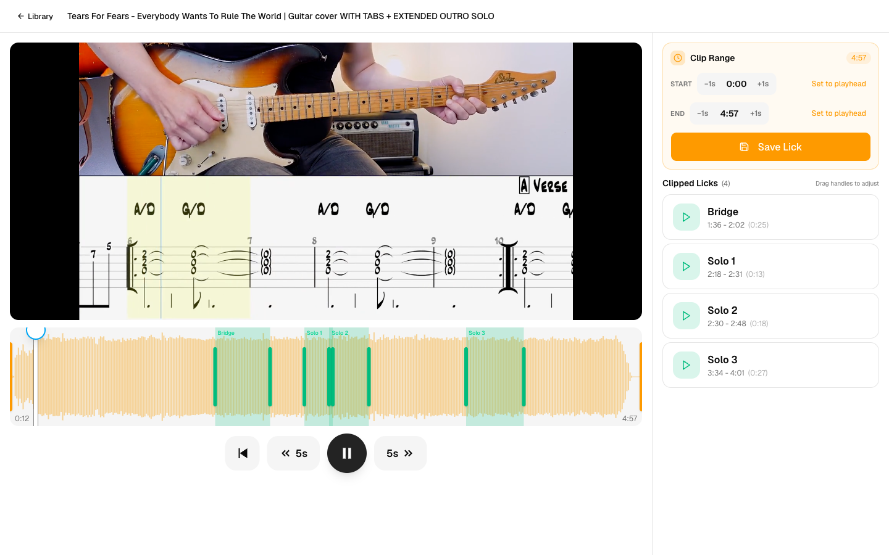

- Side-by-side YouTube embed + waveform timeline
- Set start / end via `Set to playhead` or arrow nudges (±1s)
- Drag existing lick handles directly on the waveform to refine boundaries
- Lick metadata: name, notes, position relative to source
- Save and replay any clipped lick — instantly jumps to its position in the source
- iPad-friendly: source + waveform render side-by-side, sticky left column survives scroll

[→ LickBank README](apps/lickbank/README.md)

---

### ChordCraft — train your ear on real progressions

Pick a key. Pick a difficulty. Hit play. Name what you hear before the reveal. Sounds like a song, not piano flashcards — drums and bass are mixed in, the chords are voiced for guitar.

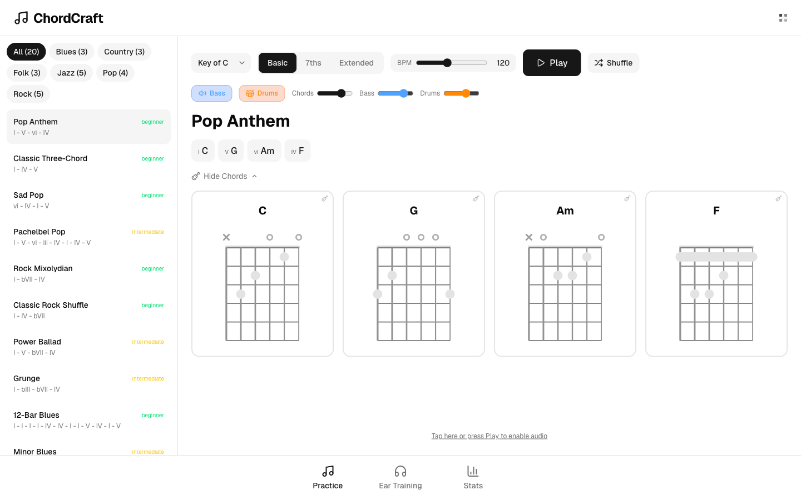

**Supported features**

*Practice mode*
- 20+ built-in progressions across Blues, Country, Folk, Jazz, Pop, Rock
- Genre filters + difficulty tags (beginner / intermediate)
- Pick any of the 12 keys
- Three chord vocabularies: Basic triads, 7ths, Extended
- BPM control 40 → 240
- Independent volume sliders for Chords, Bass, Drums
- Bass and Drums toggle on/off independently
- Guitar chord diagrams for every chord in the active progression
- Shuffle to randomize within your selected filters

*Ear training*

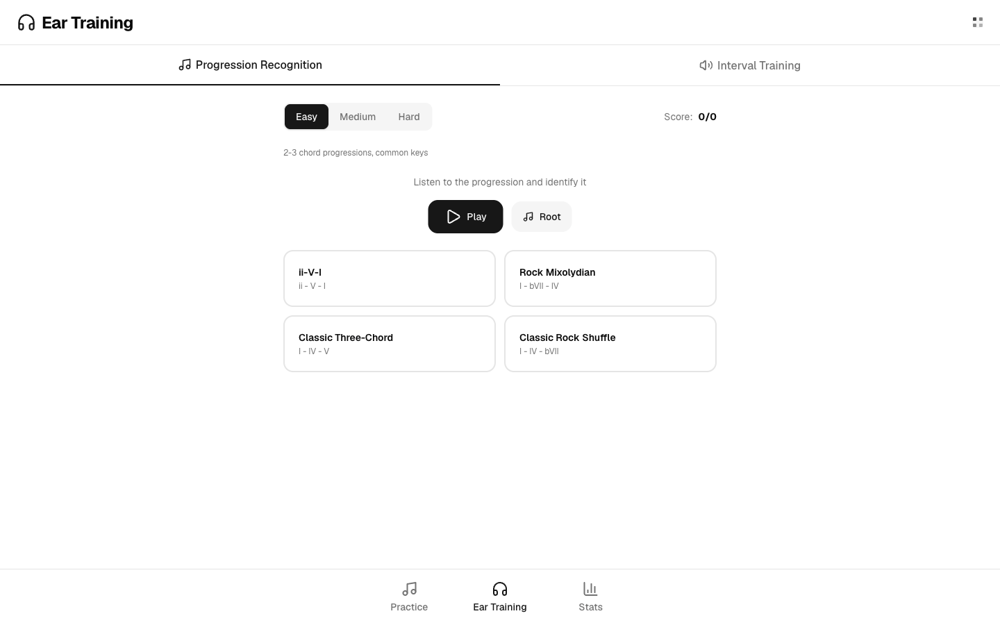

- Two modes: Progression Recognition + Interval Training
- Easy / Medium / Hard difficulty (2-3 chord → full diatonic → extended)
- Listen-and-identify with multiple-choice answers
- Score tracker

[→ ChordCraft README](apps/chordcraft/README.md)

---

### Metronome — the clean one that doesn't drift on iPad

Web-Audio scheduled (not `setInterval`), so it stays in time even on iPad Safari, which is famously terrible at audio timing.

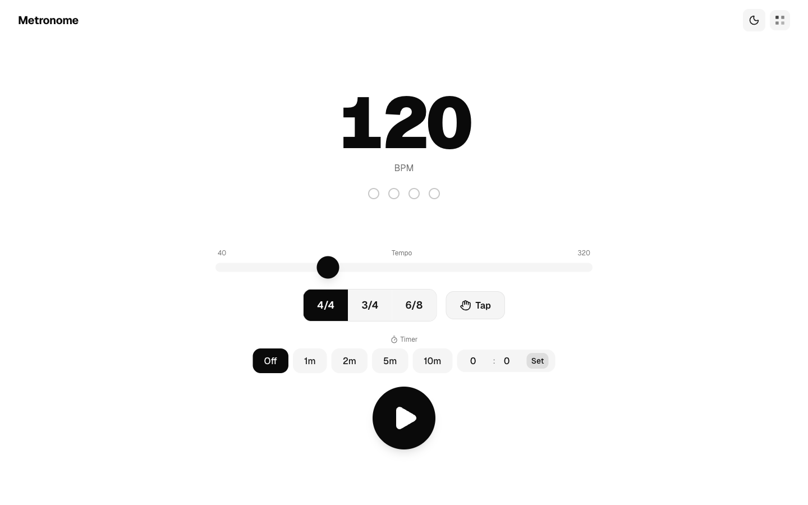

**Supported features**

- Big BPM readout, slider from 40 → 320 BPM
- Tap-tempo button
- Time signatures: 4/4, 3/4, 6/8
- Visual beat indicator dots, synced to playback
- Focus timer: Off / 1m / 2m / 5m / 10m / custom min:sec
- Volume control
- Dark / light mode toggle
- Web Audio scheduling — accurate even when the tab loses focus

[→ Metronome README](apps/metronome/README.md)

---

### SoundPath — Helix LT preset editor with AI patch designer

For anyone running a Line 6 Helix LT. Drop in a `.hlx` exported from HX Edit and SoundPath visualizes the entire signal chain, measures each snapshot's loudness, and gives you tools HX Edit doesn't have.

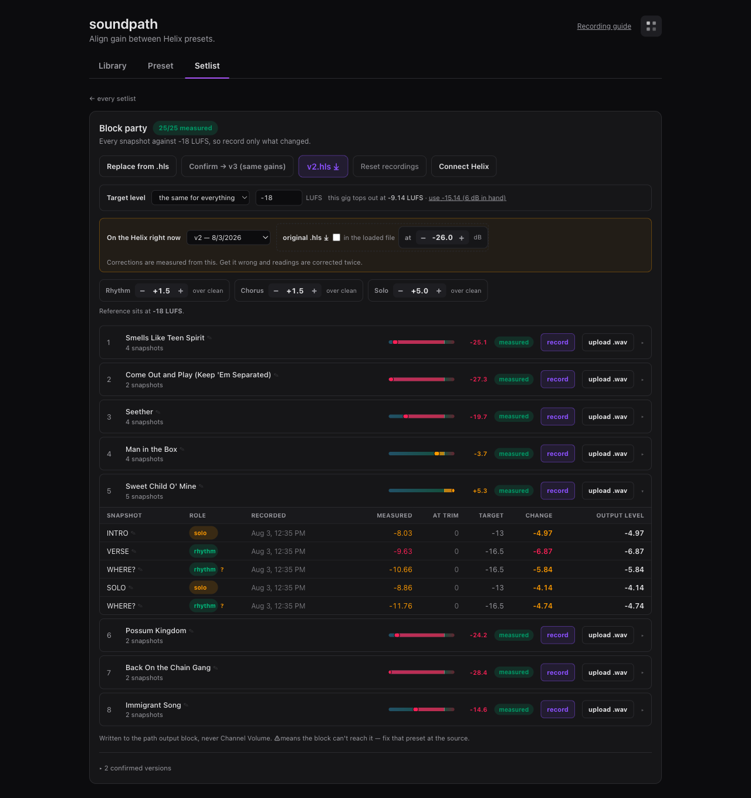

**Supported features**

*Inspection*
- Import any `.hlx` exported from HX Edit
- React-Flow signal-chain visualization across both DSP paths (split + join + parallel)
- Per-block parameter inspector (every knob from the master is rendered)
- Per-snapshot loudness landscape (8 snapshots, dB relative to CLEAN)

*Deterministic editing*
- **Align Gain** — pick any snapshot as baseline, set dB targets for every other snapshot. The aligner computes the smallest ChVol + Boost change to hit the targets without touching Drive or tone knobs. Auto-inserts a Boost block into a free slot if the chain doesn't have one.
- **Output Block baseline knob** — a preset-wide absolute dB shift, written to all four output slots, for aligning loudness between different presets

*LLM-assisted editing* (three providers: Claude / Gemini Flash / local Ollama)
- **Match Song** — supply an artist + song; the LLM proposes per-block param edits to match that recorded tone on a single snapshot
- **Tone Discovery** — describe a vibe ("warm jazz like Wes Montgomery"); the LLM picks an exemplar song first, then patches toward it
- **Design Preset** — supply 3 tone descriptions; the LLM generates a complete 8-snapshot preset from scratch using the HelAIx catalog of 367 blocks

*Staging + export*
- Live loudness preview as you stage edits — see the predicted dB landscape before applying
- Pending-change panel (across all three LLM flows + Align Gain) with reset
- Export back to a `.hlx` HX Edit imports directly
- "Open in HX Edit" one-click for local sessions

[→ SoundPath README](apps/soundpath/README.md)

---

## How they complement each other

You're not meant to use all five at once. The point is they share enough scaffolding that a session flows naturally:

- **Learning a new song?** Shreddy slows it down, ChordCraft trains the ear for the progression, Metronome holds the click.
- **Stuck on a riff?** LickBank clips it from the original, Shreddy lets you slow-loop it inside its parent song.
- **Tone not right?** SoundPath dials it in for Helix users; Shreddy stays your practice surface.

Same look-and-feel across all of them. One proxy so a single URL on your LAN reaches every app from any device. Shared utilities (YouTube import, ffmpeg pitch, practice stats) so behavior is consistent.

---

## Running it

Install once at the root:

```bash
npm install
```

Run any single app:

```bash
npm run dev:shreddy        # http://localhost:3000/shreddy
npm run dev:lickbank       # http://localhost:3001/lickbank
npm run dev:chordcraft     # http://localhost:3002/chordcraft
npm run dev:metronome      # http://localhost:3003/metronome
npm run dev:soundpath      # http://localhost:3004/soundpath
```

Each app is mounted at `/<slug>` so it composes cleanly behind the proxy below.

### One URL for all apps (optional)

The `proxy/` directory contains a small reverse proxy that fronts every app on port 8080 so a single URL reaches them all via path routing. See [`proxy/README.md`](proxy/README.md).

```bash
~/claude/run-all.sh hub    # all apps + proxy → http://localhost:8080
```

If you want them reachable off your LAN — e.g. an iPad over cellular — point [ngrok](https://ngrok.com) at the proxy: `ngrok http 8080`. Not required.

---

## Packages

| Package | Purpose |
|---|---|
| `packages/shared`         | YouTube import, ffmpeg pitch, practice stats, basepath shim — shared by Shreddy + LickBank |
| `packages/ui`             | Small set of shared components |
| `packages/gain-estimator` | Helix preset loudness math, alignment, apply pipeline — used by SoundPath. Block catalog vendored from [HelAIx](https://github.com/MrCitron/helaix) (MIT). |
| `packages/helix-builder`  | Optional Python build tooling for regenerating preset skeletons. **Not required at runtime.** Depends on phelix (GPL v3) which is not bundled — see [its README](packages/helix-builder/README.md). |

## Stack

- Next.js 16, React 19, TypeScript, Tailwind CSS v4
- SQLite via Prisma (Shreddy + LickBank)
- Python (librosa + SongFormer) for Shreddy's section detection — local, free, ~30 s/song
- ffmpeg for audio normalization, pitch shifting, slicing
- yt-dlp for YouTube ingestion
- Claude / Gemini / Ollama for the optional LLM flows in Shreddy + SoundPath

## License

[MIT](LICENSE). Take what you want.

## Why this repo exists

I'm a guitar player who builds web apps. I started writing one for my own practice (Shreddy), then needed a place to clip licks (LickBank), then ear training (ChordCraft), then a metronome that didn't drift on iPad, then a way to wrangle my Helix LT presets (SoundPath). Now they share enough scaffolding that they belong in one repo.

If any of this is useful to you, take it. Issues + PRs welcome but I run this on personal time, so responsiveness varies. Known gaps and forward-looking items live in [OPEN.md](OPEN.md).
