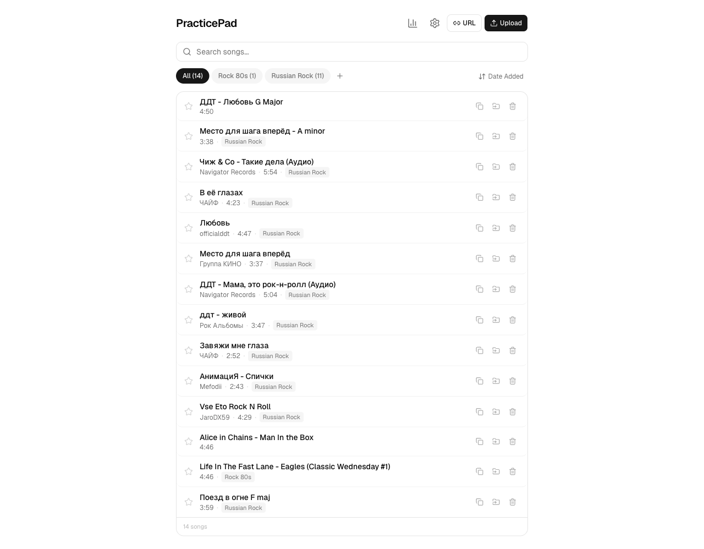
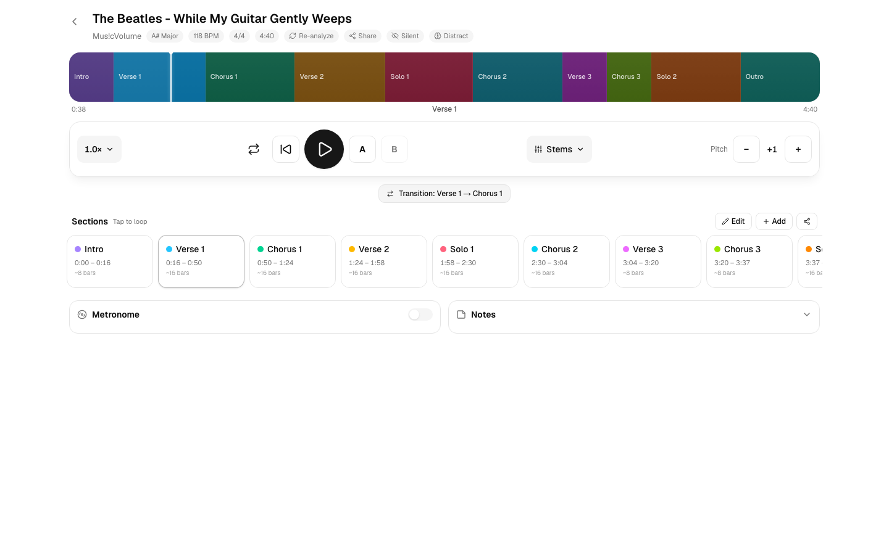
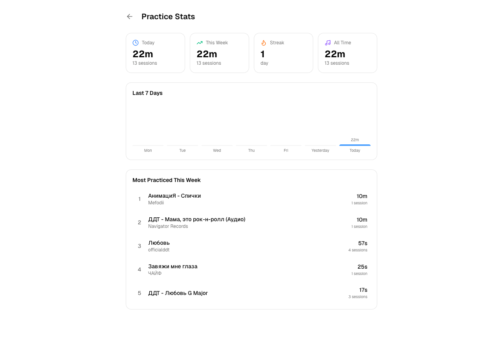
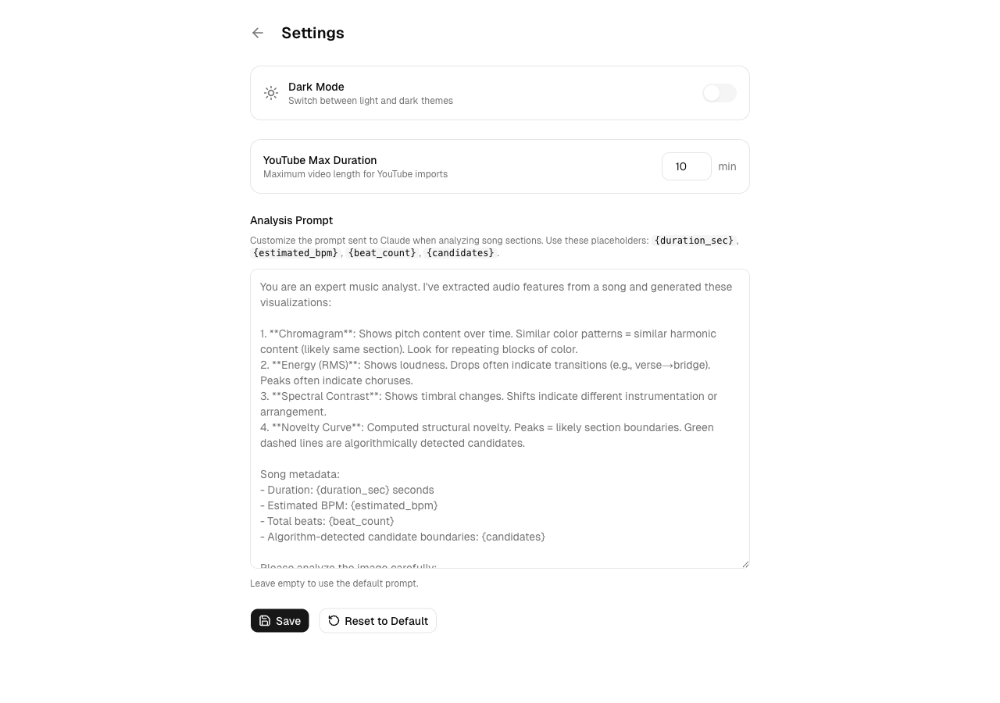

# Shreddy

A local-first guitar practice companion web app. Upload songs or import from YouTube, get local AI section detection, and practice with tempo control, pitch shifting, section looping, and a built-in metronome. Optimized for iPad Safari.



## Features

### Song Library
- **Upload MP3/MP4** files or **import from YouTube** by URL
- **Local AI section detection** — librosa for BPM/key/beats + the local SongFormer model to automatically identify Intro, Verse, Chorus, Bridge, Solo, Outro, etc. No cloud round-trip (~30–60s/song on M-series Macs)
- **Auto-detected metadata** — BPM, musical key, artist, album, genre, year (from ID3 tags or YouTube)
- **Folder organization** — create folders, move songs between them
- **Pin songs** to the top of the library
- **Search and sort** by title, artist, date added, or recent

### Practice Player



- **Visual waveform timeline** with color-coded sections — see the full song structure at a glance
- **Tempo control** — slow down to 0.1x or speed up to 1.2x without affecting pitch (ultra-slow 0.1x–0.4x uses a server-side ffmpeg stretch, since iPad Safari clamps `playbackRate` at 0.5x)
- **Pitch shifting** — transpose up or down by up to 12 semitones without affecting duration (server-side processing via ffmpeg, cached per song/pitch)
- **Stem separation (Demucs)** — split into vocals / drums / bass / other with a per-stem mixer to isolate or mute parts
- **Deep-practice modes** — Silent/mental-rehearsal toggle (mutes audio while the playhead keeps running), rotating cue prompts, and a dual-task Distraction overlay
- **Musical key display** — auto-detected key adjusts when you shift pitch (e.g., A Minor + 2 = B Minor)
- **Section looping** — tap any section to loop it, shift-tap for multi-section ranges
- **A-B looping** — set custom loop points anywhere in the song
- **Whole-song loop** toggle
- **Loop counter** — tracks how many times you've looped each section
- **Built-in metronome** with beat sync, volume control, count-in, tap tempo, and visual beat indicator
- **Practice notes** — add free-text notes per song
- **Re-analyze** — re-run AI section detection with one tap
- **Remembers state** — last position, tempo, pitch, and selected sections are restored on next visit

### Practice Stats



- **Daily, weekly, and all-time** practice time and session counts
- **Practice streak** tracking (consecutive days)
- **7-day bar chart** showing daily practice duration
- **Top 5 most-practiced songs** this week with time and session counts
- Per-section practice logs (loop counts and time spent)

### Settings



- **Dark / light mode**
- **YouTube import** max duration setting

## Tech Stack

- **Frontend**: Next.js 16, React 19, TypeScript, Tailwind CSS v4, shadcn/ui
- **Database**: SQLite via Prisma with libSQL adapter
- **Audio processing**: ffmpeg/ffprobe for normalization and pitch shifting
- **Audio analysis**: Python (librosa) for BPM, key, beat detection + local SongFormer model for section segmentation; Demucs for stem separation
- **YouTube import**: yt-dlp

## Setup

Shreddy is part of the **[music-apps](../../README.md) monorepo** — you don't clone or run it standalone. Install once at the monorepo root, then start Shreddy.

### Prerequisites

- Node.js 20+
- Python 3.10+ with a virtual environment (librosa + SongFormer for local analysis — no cloud API key needed for section detection)
- ffmpeg and ffprobe
- yt-dlp (for YouTube imports)
- The SongFormer model (~2.8 GB) under `apps/data/models/songformer/` — gitignored, fetched separately; without it, section detection fails at runtime

### Install & run

```bash
# From the monorepo root
npm install
npm run dev:shreddy        # → http://localhost:3000/shreddy
```

For iPad on your LAN, use webpack mode (Turbopack doesn't work on iPad Safari):

```bash
cd apps/shreddy
npx next dev --hostname 0.0.0.0 --webpack   # → http://<your-mac-ip>:3000/shreddy
```

For the most reliable iPad experience, run a production build: `npm run build && npm start`. Note the `/shreddy` basePath — the app is always mounted at `/shreddy` so it composes behind the music-apps proxy. See the [monorepo README](../../README.md) and `CLAUDE.md`.

## Architecture

Within the music-apps monorepo:

```
apps/shreddy/               # this app (mounted at /shreddy)
├── prisma/                 # Database schema & migrations
├── src/
│   ├── app/                # Pages and API routes
│   │   ├── page.tsx            # Song library
│   │   ├── songs/[id]/         # Practice player
│   │   ├── stats/              # Practice statistics
│   │   ├── settings/           # App settings
│   │   └── api/                # REST API endpoints
│   ├── hooks/              # Custom React hooks (metronome, tempo stretch, stems)
│   ├── components/         # shadcn/ui + practice components
│   └── lib/                # Server utilities (audio processing, DB)
apps/scripts/
│   └── analyze.py          # Audio analysis (librosa) + SongFormer section detection
apps/data/                  # SQLite DB, audio files, uploads, SongFormer model
```

## License

MIT
